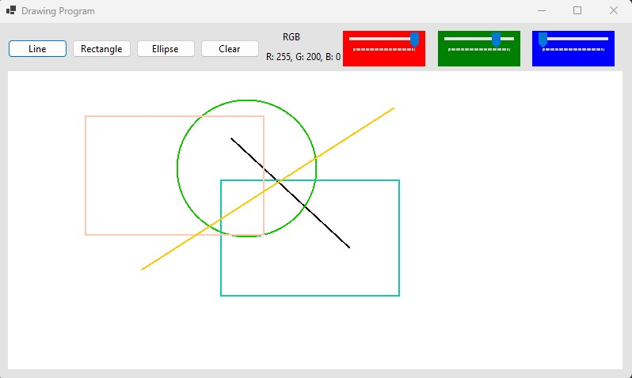

# Drawing Program

## Overview

The Drawing Program is a simple application that allows users to draw lines, rectangles, and ellipses on a canvas. Users can choose the drawing tool and color to create custom drawings. The program is built using C# and Windows Forms.
